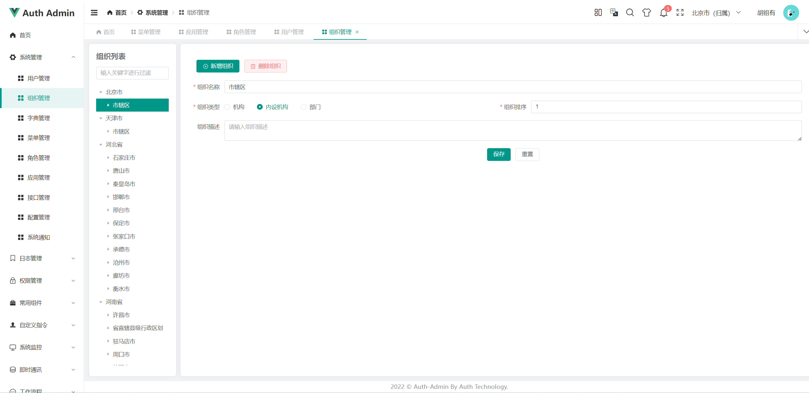
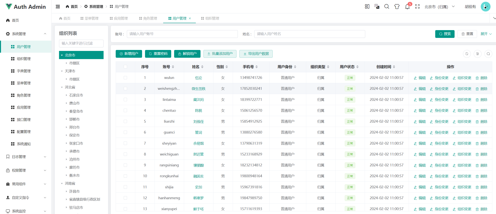
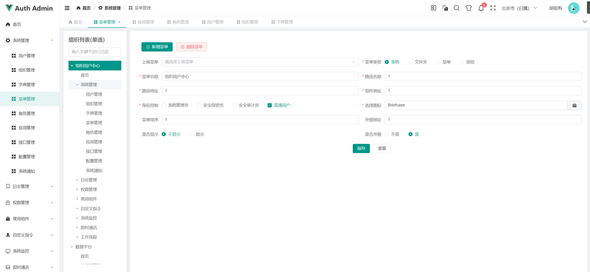
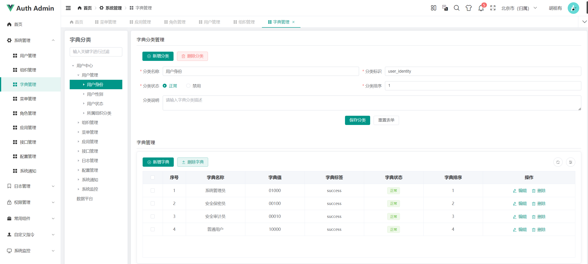

### 平台简介
    1. 该系统是一套通用的后台管理系统，用于简化业务系统开发和集成。内部集成了redis、kafka、zookeer等组件。注意，该项目为本人学习项目。免费开源。如有侵权问题，及时联系删除。
    2. 该系统前端使用`Geeker-Admin`提供的模板,相当好用,感谢支持。https://github.com/HalseySpicy/Geeker-Admin
### 技术栈
* spring-boot：3.2.3
* spring.cloud：2023.0.0
* spring.cloud.alibaba： 2023.0.0.0-RC1
* mybatis-plus：3.5.5

### 系统功能
#### 1. 组织管理

#### 2. 用户管理

#### 3. 菜单管理

#### 4. 字典管理

#### 5. 角色管理
#### 6. 接口管理
#### 7. 配置管理
#### 8. 系统通知
#### 9. 应用管理
