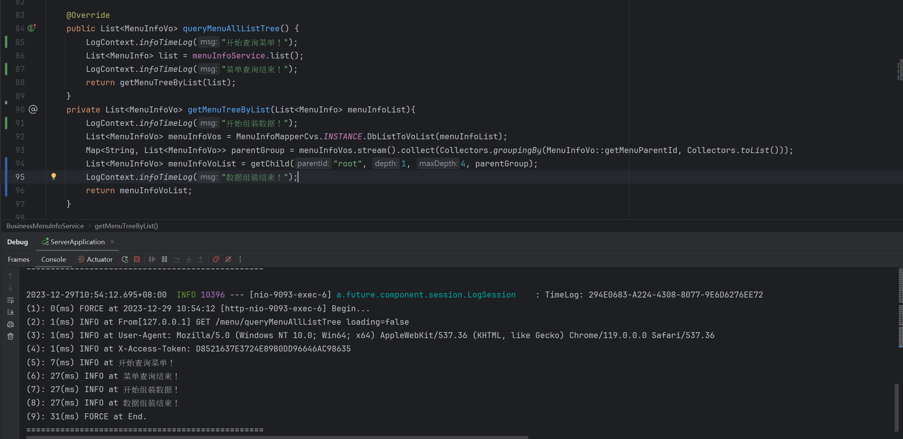

### 项目日志输出说明
本项目日志输出定义于auth-future-component-session模块中，通过filter的方式，定义请求日志，包括每次请求的执行时间，执行token，请求URL等。
#### 1. 日志框架 logback
#### 2. 日志配置文件： classpath: [logback-spring.xml](..%2Fauth-future-framework-server%2Fsrc%2Fmain%2Fresources%2Flogback-spring.xml)
#### 3. 配置说明：
##### (1) 日志级别的调整可通过properties配置文件来指定
```properties
logging.config=classpath:logback-spring.xml
logging.level.root=info
```
##### (2) 如何取消引入logback后启动时输出很多无用的日志
```xml
<!-- 第一步: 引入spring boot默认的logback配置文件 -->
<include resource="org/springframework/boot/logging/logback/defaults.xml"/>
<!-- 控制台输出日志 -->
<appender name="STDOUT" class="ch.qos.logback.core.ConsoleAppender">
    <encoder>
        <!-- 第二步：设置控制套输出日志格式为第一步中引入的默认的格式 -->
        <pattern>${CONSOLE_LOG_PATTERN}</pattern>
        <charset class="java.nio.charset.Charset">UTF-8</charset>
    </encoder>
</appender>
```
##### (3) 如何控制写入文件的日志
* 根据需要，开启和注释对应的日志级别即可
* 如果需要修改日志的保存时间，保存路径等，到对应的Appender标签中修改即可
* 对应的，如果需要管理某个级别日志的输出，或者不需要同步到kafka，则注释对应的appender即可
```xml
    <!--  监控所有包，日志输入到以下位置，并设置日志级别  -->
    <root level="WARN">
        <!--输入到控制台-->
        <appender-ref ref="STDOUT"/>
        <!--INFO 级别的日志输入到文件-->
        <appender-ref ref="infoAppender"/>
        <!--DEBUG 级别的日志输入到文件-->
        <appender-ref ref="debugAppender"/>
        <!--WARN 级别的日志输入到文件-->
        <appender-ref ref="warnAppender"/>
        <!--ERROR 级别的日志输入到文件-->
        <appender-ref ref="errorAppender"/>
        <!-- 日志集成ELK框架 ，将日志发送到kafka中 -->
        <appender-ref ref="kafkaAppender"/>
    </root>
```
#### 4. 如何集成ELK
* 目前集成ELK的方式是，先将日志写入到kafka中，logstash收到日志后在写入到es，最终由kibana展示。
* 所以如果想要集成到ELK，前提是需要具备： kafka、ELK环境。
* 环境具备后，需要配置logback-spring.xml
##### (1) 第一步 自定义KafkaAppender
auth.future.component.session.elk.KafkaAppender
```java
package auth.future.component.session.elk;

import ch.qos.logback.classic.Level;
import ch.qos.logback.classic.spi.ILoggingEvent;
import ch.qos.logback.core.Layout;
import ch.qos.logback.core.OutputStreamAppender;
import org.apache.kafka.clients.producer.KafkaProducer;
import org.apache.kafka.clients.producer.Producer;
import org.apache.kafka.clients.producer.ProducerRecord;

import java.io.OutputStream;
import java.util.Properties;

public class KafkaAppender<E> extends OutputStreamAppender<E> {
    private Producer<String,String> logProducer;
    private String bootstrapServers;
    private Layout<E> layout;
    private String topic;
    @Override
    protected void append(E event) {
        if (event instanceof ILoggingEvent) {
            String msg = layout.doLayout(event);
            Level level = ((ILoggingEvent) event).getLevel();
            String string = level.toString();
            ProducerRecord<String, String> producerRecord = new ProducerRecord<>(topic, 0,string, msg);
            logProducer.send(producerRecord);
        }
    }

    @Override
    public void start() {
        logProducer = createProducer();
        OutputStream targetStream = new KafkaOutputStream(logProducer, topic);
        super.setOutputStream(targetStream);
        super.start();
    }

    @Override
    public void stop() {
        super.stop();
        if (logProducer != null) {
            logProducer.close();
        }
    }

    //创建生产者
    private Producer<String,String> createProducer() {
        synchronized (this) {
            if (logProducer != null) {
                return logProducer;
            }
            Properties props = new Properties();
            props.put("bootstrap.servers", bootstrapServers);
            //判断是否成功，我们指定了“all”将会阻塞消息 0.关闭 1.主broker确认 -1（all）.所在节点都确认
            props.put("acks", "0");
            //失败重试次数
            props.put("retries", 0);
            //延迟100ms，100ms内数据会缓存进行发送
            props.put("linger.ms", 100);
            //超时关闭连接
            //props.put("connections.max.idle.ms", 10000);
            props.put("batch.size", 16384);
            props.put("buffer.memory", 33554432);
            //该属性对性能影响非常大，如果吞吐量不够，消息生产过快，超过本地buffer.memory时，将阻塞1000毫秒，等待有空闲容量再继续
            props.put("max.block.ms",1000);
            props.put("key.serializer", "org.apache.kafka.common.serialization.StringSerializer");
            props.put("value.serializer", "org.apache.kafka.common.serialization.StringSerializer");
            return new KafkaProducer<>(props);
        }
    }

    public String getBootstrapServers() {
        return bootstrapServers;
    }

    public void setBootstrapServers(String bootstrapServers) {
        this.bootstrapServers = bootstrapServers;
    }

    public Layout<E> getLayout() {
        return layout;
    }

    @Override
    public void setLayout(Layout<E> layout) {
        this.layout = layout;
    }

    public String getTopic() {
        return topic;
    }

    public void setTopic(String topic) {
        this.topic = topic;
    }
}
```
```java
package auth.future.component.session.elk;

import org.apache.kafka.clients.producer.Producer;
import org.apache.kafka.clients.producer.ProducerRecord;
import org.springframework.lang.NonNull;

import java.io.OutputStream;
import java.nio.charset.Charset;

public class KafkaOutputStream extends OutputStream {


    private final Producer<String,String> logProducer;
    String topic;

    public KafkaOutputStream(Producer<String,String> producer, String topic) {
        this.logProducer = producer;
        this.topic = topic;
    }


    @Override
    public void write(int b){
        this.logProducer.send(new ProducerRecord<>(this.topic, String.valueOf(b)));
    }

    @Override
    public void write(@NonNull byte[] b){
        this.logProducer.send(new ProducerRecord<>(this.topic, new String(b, Charset.defaultCharset())));
    }

    @Override
    public void flush(){
        this.logProducer.flush();
    }
}
```
##### (2)第二步： 配置logback-spring.xml中放入kafkaAppender
* 注意，auth.future.component.session.elk.KafkaAppender 这个类是自定义的，需要修改该类所在的路径。
* 配置中的kafka相关参数按照实际项目进行配置
* logstash中的topic配置必须和此处的topic一至。
```xml
<!--  往kafka推送日志  -->
<appender name="kafkaAppender" class="auth.future.component.session.elk.KafkaAppender">
    <!-- kafka地址 -->
    <bootstrapServers>192.168.0.36:39193,192.168.0.36:39194,192.168.0.36:39195</bootstrapServers>
    <!-- 配置topic -->
    <topic>demoCoreKafkaLog</topic>
    <!-- encoder负责两件事，一是将一个event事件转换成一组byte数组，二是将转换后的字节数据输出到文件中 -->
    <encoder>
        <pattern>${HOSTNAME} %date [%thread] %level %logger{36} [%file : %line] %msg%n</pattern>
        <charset>utf8</charset>
    </encoder>
    <!-- layout主要的功能就是：将一个event事件转化为一个String字符串 -->
    <layout class="ch.qos.logback.classic.PatternLayout">
        <pattern>${HOSTNAME} %date [%thread] %level %logger{36} [%file : %line] %msg%n</pattern>
    </layout>
</appender>
```
开启kafkaAppender
```xml
<!--  监控所有包，日志输入到以下位置，并设置日志级别  -->
<root level="WARN">
    <!--输入到控制台-->
    <appender-ref ref="STDOUT"/>
    <!--INFO 级别的日志输入到文件-->
    <appender-ref ref="infoAppender"/>
    <!--DEBUG 级别的日志输入到文件-->
    <appender-ref ref="debugAppender"/>
    <!--WARN 级别的日志输入到文件-->
    <appender-ref ref="warnAppender"/>
    <!--ERROR 级别的日志输入到文件-->
    <appender-ref ref="errorAppender"/>
    <!-- 日志集成ELK框架 ，将日志发送到kafka中 -->
    <appender-ref ref="kafkaAppender"/>
</root>
```
#### 5. 如何利用日志输出每个接口的或者每个代码片段的执行时间
使用LogContext日志上下文对象，在需要打印时间的地方加入
```text
LogContext.infoTimeLog("日志说明（如执行的方法名）");
LogContext.errorTimeLog("");
LogContext.warnTimeLog("");
```
例如：以下代码中我们在方法中的不通代码片段上打印了日志，根据控制台的日志输出，可看出每个片段开始到结束的执行时间。
```java
    @Override
    public List<MenuInfoVo> queryMenuAllListTree() {
        LogContext.infoTimeLog("开始查询菜单！");
        List<MenuInfo> list = menuInfoService.list();
        LogContext.infoTimeLog("菜单查询结束！");
        return getMenuTreeByList(list);
    }
    private List<MenuInfoVo> getMenuTreeByList(List<MenuInfo> menuInfoList){
        LogContext.infoTimeLog("开始组装数据！");
        List<MenuInfoVo> menuInfoVos = MenuInfoMapperCvs.INSTANCE.DbListToVoList(menuInfoList);
        Map<String, List<MenuInfoVo>> parentGroup = menuInfoVos.stream().collect(Collectors.groupingBy(MenuInfoVo::getMenuParentId, Collectors.toList()));
        List<MenuInfoVo> menuInfoVoList = getChild("root", 1, 4, parentGroup);
        LogContext.infoTimeLog("数据组装结束！");
        return menuInfoVoList;
    }
```
```text
2023-12-29T10:54:12.695+08:00  INFO 10396 --- [nio-9093-exec-6] a.future.component.session.LogSession    : TimeLog: 294E0683-A224-4308-8077-9E6D6276EE72
(1): 0(ms) FORCE at 2023-12-29 10:54:12 [http-nio-9093-exec-6] Begin...
(2): 1(ms) INFO at From[127.0.0.1] GET /menu/queryMenuAllListTree loading=false
(3): 1(ms) INFO at User-Agent: Mozilla/5.0 (Windows NT 10.0; Win64; x64) AppleWebKit/537.36 (KHTML, like Gecko) Chrome/119.0.0.0 Safari/537.36
(4): 1(ms) INFO at X-Access-Token: D8521637E3724E89B0DD96646AC98635
(5): 7(ms) INFO at 开始查询菜单！
(6): 27(ms) INFO at 菜单查询结束！
(7): 27(ms) INFO at 开始组装数据！
(8): 27(ms) INFO at 数据组装结束！
(9): 31(ms) FORCE at End.
=================================================
```



